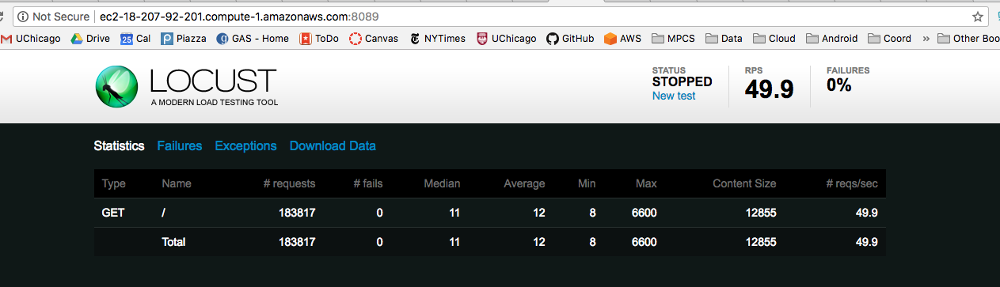
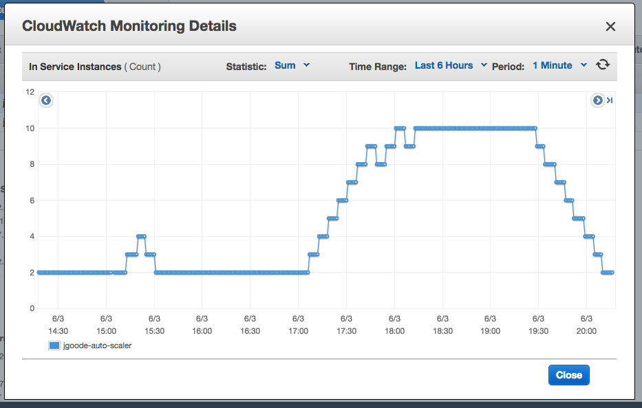
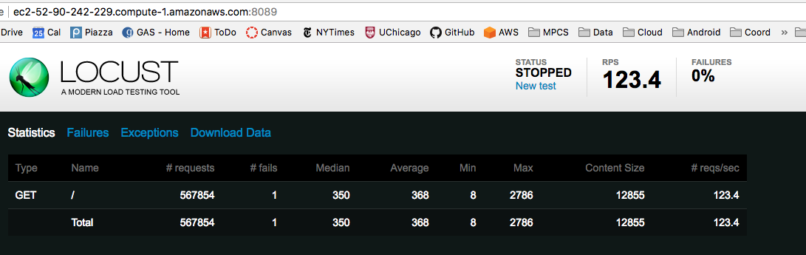
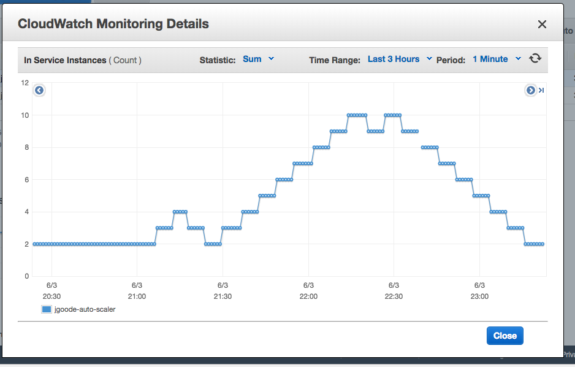
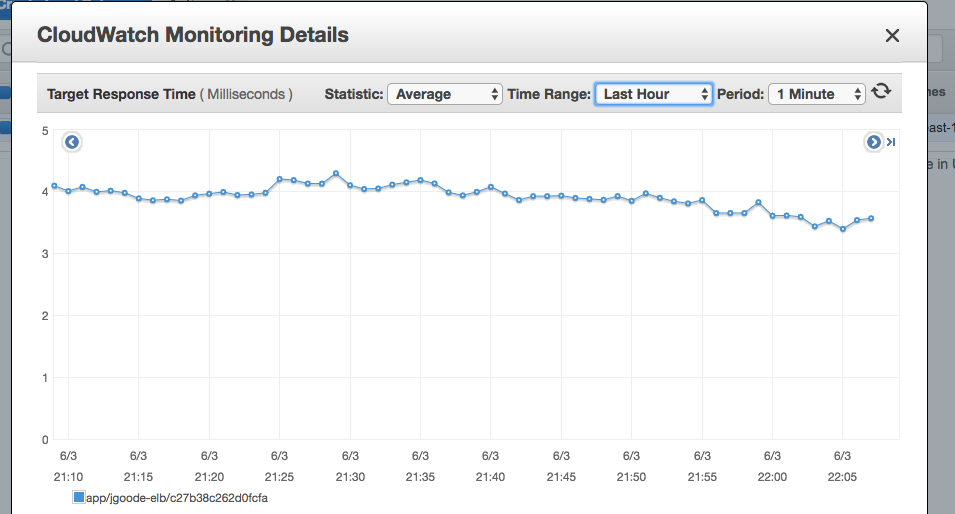

# GAS Final Project (Jason Goode)

## Important Notes
* **Project URL**: https://jgoode.ucmpcs.org
* **Web Instance Names:** jgoode-capstone-elb-web
* **Annotator Instance Names:** jgoode-capstone-ann

## Short Answer

#### 7) Glacier Archiving Approach 
First, I created a queue called “jgoode_archive_time-check” and subscribed it to the results SNS topic (that run.py publishes to when a job is completed). I then read from this queue on a loop, calculate the amount of time that has passed since completion of the job, and implement some conditional logic:

* If the user is premium, I simply delete the message since it doesn’t need to be archived. I also update the archive status in dynamo (I created this attribute) to N/A, which lets me know the user was premium when the job completed. 
* Else if less than 30 minutes have passed, I ignore the message, and let it sit in the queue for longer
* Else, if more than 30 minutes have passed and the user is a free user, I initiate the archive process. I get the object from S3, archive it, then delete it from S3. I also persist the archive ID (so I can retrieve it later) and update a the “archive_status” attribute in Dynamo to “archived” so I can maintain the state of the object. Once the file is archived, i delete the message from the queue

#### 9) Glacier Retrieval/Thawing Approach 
In views.py, once a user subscribes to premium, I query the Dynamo database on the user_id_index to get all entries associated with that user. After updating the user status to premium, I initiate the retrieval jobs by referencing the archive ID captured earlier. I instruct boto3 to send a notification to a new sns topic I’ve created called “jgoode_glacier_retrieval” to which an SQS topic with the same name subscribes. There will likely be some delay in getting the object restored, so I update the archive status to RETRIEVING (which I use to tell newly minted premium users to be patient, their files will be restored for download soon). 

In archive_restore.py, I poll the queue for completed archive jobs. I then use the archive description to obtain the s3 key (I made the s3 key the description at point of archival for this purpose!), and put it back into the same place it originally was on s3. Finally, I update the archive_status to RESTORED in my DynamoDB. 

#### 13) Load Testing Observations (Web Server)

*Note:* In all web server load testing, I only made HTTP requests to "/". 

**100 users @ 5 users/second**: The ELB seemed to handle this load test just fine. My "And then wait" was set to 300 seconds, so my # of instances steadily increased from 2 to 10, adding an instance every 5 minutes (300 seconds). See note below on why we should allow a gap in between each scaling action. 

Given that my alarm was set to 200 HTTP requests/minute, and Locust sent requests at 49.9 requests/second, it is no surprise that the app scaled out to the maximum number of instances. One surprising observation, though, was after stopping the Locust load test and terminating the Locust instance, my # of instances stayed at 10! I decideed I would leave it alone for a bit just to see what happened, and after reading about it more, I realized that my alarms were set to ignore missing data. Since the number of HTTP requests dropped to 0 (and produced no data, the state moved "Insufficient Data" and my scale-in polocy was never triggered). I then went in to reset my scale-in policy to treat missing data as bad (trigger the scale in alarm), since a very low number of HTTP requests would mean there is no need for excess instances. On the other hand, I set my scale out alarm to treat missing data as good (set alarm status to OK), since we don't need to scale out when there are no HTTP requests. 

*Thoughts on the "and then wait" polciy:* It makes sense to suspend scaling activities for a few minutes after an alarm is triggered, as it gives the new instances a chance to run their configuration scripts and see if yet another instance is necessary. Without this time period, the alarm would keep triggering new instances immediately without having a good sense of how much capacity "n-1" instances could handle. This could result in launching unnecessary instances.

**Locust Test**: 

**Instance Count**:

**300 users @ 30 users/second**: I wanted to try to max out the load recommended in the assignment, so I ended up using a slightly bigger instance (t2.small) to support 300 requests. If I used a t2.nano, the locust script would fail. The ELB actually seemed to handle the requests quite well, though I found it surprising that the number of instances actually fluctuated a bit instead of going straight to 10. In general though, it scaled up one instance every 5 minutes, and scaled back down once I stopped it. Another odd observation: AWS measured the average 1 min response as ~4ms, which seemed low for such a large load. This then triggered the scale in alarm (10ms or below), so I set this to 2ms for a bit. Once I cancelled locust, I set it back to 10ms and it scaled down just fine since it was in an alarm state. I don't  

I actually ended up moving my 10ms trigger to 2ms because the requests were all coming in at about 4ms. If I never lowered it, the 10ms alarm wouldn't be triggered to scale in. See below for performance stats and instance behavior:

**Locust Test**: 

**Instance Count**:

**Response Times (300 users)**:

